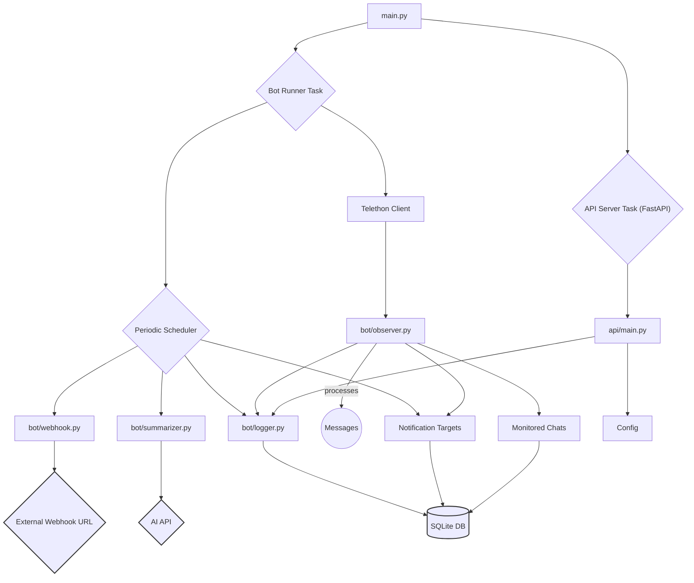

# Assetmatic Micro 1: Passive Telegram Observation Bot

A modular Python project that creates a passive Telegram bot using a user account. It observes message flow, logs details (including links/media info) to SQLite, and allows for dynamic control via Telegram commands.

## Features

- **Passive Observation:** Monitors messages in specified Telegram groups/chats or all chats the user account is in.
- **Detailed Logging:** Saves message details (text, sender, chat, timestamp, entities, media info) to a local SQLite database.
- **Dynamic Chat Monitoring:** Control which specific chats are monitored using commands (`/monitor_add`, `/monitor_remove`, `/monitor_list`, `/monitor_clear`). Monitors all chats by default.
- **Multi-Target Notifications:** Forwards customizable notifications for observed messages to one or more configured Telegram users.
- **Notification Control:** Pause/resume notifications (`/stop_forwarding`, `/start_forwarding`) and manage recipients (`/notify_add`, `/notify_remove`, `/notify_list`) via commands.
- **Scheduled AI Summaries:** Periodically generates an AI summary of recent messages and sends it to all notification targets (requires AI API configuration).
- **On-Demand AI Summaries:** Request an AI summary for the current day via `/summary_today` command.
- **Optional Scheduled Webhook:** Can optionally send batches of raw message data to an external webhook URL at a configured interval.
- **API Monitoring:** Includes a basic FastAPI server with `/health` and `/status` endpoints.
- **Automatic Group Joining:** Attempts to join public groups listed in configuration.
- **Modular Design:** Separated components for bot logic, API, database, AI, etc.
- **Deployment Ready:** Supports Docker and includes GitHub Codespaces configuration.

## Setup and Installation

1.  **Clone the Repository:**
    ```bash
    git clone <repository-url>
    cd assetmatic-micro-1
    ```

2.  **Create and Activate Conda Environment (Recommended):**

    As per project requirements, Python dependencies must be managed within a Conda environment.

    ```bash
    # Create a new environment (e.g., named 'assetmatic_env') with Python 3.10+
    conda create -n assetmatic_env python=3.10 -y

    # Activate the environment
    conda activate assetmatic_env
    ```
    *You must have this environment active for the following steps and whenever running the bot.*

3.  **Install Dependencies:**

    Ensure your Conda environment is active before running:
    ```bash
    pip install -r requirements.txt
    ```

4.  **Create and Configure `.env` file:**

    Create a `.env` file in the project root. **Minimum required:** `API_ID`, `API_HASH`.

    ```dotenv
    # --- Telegram API Credentials (REQUIRED) ---
    API_ID=12345678
    API_HASH=your_api_hash_string_here

    # --- Bot Configuration ---
    BOT_NAME=MyObserverBot # Name for instance & session file
    # Comma-separated public group links/usernames bot should attempt to join
    TELEGRAM_GROUPS=https://t.me/some_public_group,@another_group

    # --- Scheduled Tasks Interval (Minutes) ---
    # Controls how often AI summary is sent AND optional webhook is triggered
    WEBHOOK_INTERVAL_MINUTES=30 # Default: 30

    # --- Optional External Webhook ---
    # If set, sends raw message batches to this URL periodically
    # WEBHOOK_URL=https://your-webhook-endpoint.com/data

    # --- Optional AI Configuration (for Summaries) ---
    # OpenAI-compatible endpoint (e.g., for Gemini)
    AI_API_BASE=https://your-ai-endpoint.com/v1
    AI_API_KEY=YOUR_AI_API_KEY_HERE
    AI_MODEL_NAME=gemini-pro # Or specific model like gemini-2.5-pro-exp-03-25
    ```

5.  **Initial Database Setup:**
    The first time you run the bot, it will create the SQLite database file in the `data/` directory. If you encounter schema errors after code updates, delete `data/observations.db` and let the bot recreate it on the next run.

## Running the Bot

Ensure your Conda environment is active (`conda activate assetmatic_env`).

```bash
python main.py
```
*   **First Run:** Authorize the session by entering your phone number, login code, and potentially 2FA password when prompted.
*   **API:** The FastAPI server will also start (usually on `http://localhost:8000`). Check `/health` for status.
*   **Stopping:** Press `Ctrl+C`.

## Interacting with the Bot (Commands)

Send from the **Owner** account (whose API creds are used) to the bot (e.g., Saved Messages):

**Notification Control:**
*   `/stop_forwarding`: Pauses sending notifications for new messages to all targets.
*   `/start_forwarding`: Resumes notifications (shows summary of missed).

**Notification Targets:**
*   `/notify_add <user_id or username>`: Add another user to receive notifications/summaries.
*   `/notify_remove <user_id or username>`: Stop sending notifications/summaries to this user (cannot remove owner).
*   `/notify_list`: Show all users currently receiving notifications/summaries.

**Monitoring Scope:**
*   `/monitor_add <chat_id or username/link>`: Add a specific chat to the monitor list. Once the list is populated, only messages from these chats will be processed.
*   `/monitor_remove <chat_id or username/link>`: Remove a chat from the monitor list.
*   `/monitor_list`: Show the list of currently monitored chats.
*   `/monitor_clear`: Clears the entire monitor list, reverting to processing messages from all chats.

**Summarization:**
*   `/summary_today`: Requests an AI-generated summary of messages logged today (requires AI env vars to be set).

**Help:**
*   `/help`: Shows this help message.

## API Endpoints

When running, the FastAPI server is available (default: `http://localhost:8000`):

*   `GET /health`: Returns `{"status": "ok"}` if the API server is running.
*   `GET /status`: Returns a JSON object with current bot status, DB stats, configuration info.

## Project Structure


*(Simplified view)*

## Configuration Options

Loaded from the `.env` file:

*   `API_ID`, `API_HASH`: Your Telegram credentials (**Required**).
*   `BOT_NAME`: Name for session file (Default: `DefaultBotName`).
*   `TELEGRAM_GROUPS`: Comma-separated public groups/usernames to join (Optional).
*   `WEBHOOK_INTERVAL_MINUTES`: Interval in minutes for scheduled summary & optional webhook (Default: `30`).
*   `WEBHOOK_URL`: URL for optional external webhook sending raw message batches (Optional).
*   `AI_API_BASE`, `AI_API_KEY`: AI service endpoint/key (**Required for Summaries**).
*   `AI_MODEL_NAME`: AI model for summarization (Default: `gemini-pro`).

## Development

# ... (same) ...

## License

# ... (same) ...